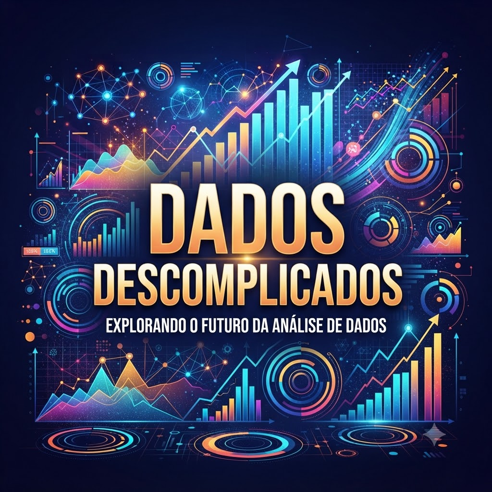

    <audio src="output/podcast_editado.mp3" controls title="Podcast editado"></audio>

# Podcast "Dados Descomplicados"

Este repositório reúne o roteiro e a identidade visual do podcast **Dados Descomplicados**, criado para apresentar análise de dados de forma simples, direta e acessível para iniciantes.

## 🎙️ O que tem neste projeto

- Roteiro de podcast gerado com IA para um público iniciante.
- Capa criada com foco em elementos visuais ligados a dados.
- Áudios narrados e editados com apoio de ferramentas online.
- Áudio final exportado em `output/podcast_editado.MP3`.

## 🧠 Prompt usado no roteiro

> "Crie um roteiro de podcast de tecnologia, focado em análise de dados, cujo nome você pode sugerir, com público-alvo iniciantes em dados. Formato: Intro (estilo Leon Martins/Coisa de Nerd), Fato 1 (inicial em dados), Fato 2 (ferramentas), Finalização (despedida cool). Regras: Uma pessoa só, evite termos técnicos, máximo 5 minutos."

O roteiro foi pensado para ficar leve e fácil de narrar, com esta estrutura:

- Introdução acolhedora e dinâmica.
- Explicação simples sobre o que são dados.
- Sugestões de ferramentas para começar, como planilhas e visualização.
- Encerramento descontraído e curto.

## 🎨 Prompt usado na capa

> "Crie uma imagem para capa do podcast com elementos de dados."

> "Recrie somente com elementos de dados e o título 'Dados Descomplicados'."

A arte final prioriza uma estética moderna, limpa e com foco em gráficos e elementos digitais.

## 🚀 Como usar

1. Leia o roteiro em `src/prompts/gemini.md`.
2. Use o texto gerado como base para gravação ou narração.
3. Edite o áudio no editor de sua preferência, se necessário.
4. Consulte os arquivos em `assets/` e `output/` como referência do resultado final.

## 🛠️ Ferramentas usadas

- Gemini para estruturação do roteiro.
- Nano Banana para geração da capa.
- LuvVoice para criação dos áudios.
- MP3Cut para edição online do áudio.

## 📁 Estrutura

- `assets/` contém a capa e materiais visuais.
- `output/` contém o áudio final exportado.
- `src/prompts/` contém os prompts usados na criação.

---

_Projeto criado com apoio de IA para estudo de fluxo criativo, geração de roteiro, produção de voz e edição de podcast._
